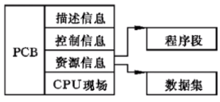
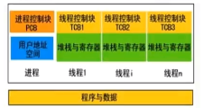

# Java 多线程与并发
## 1. 进程与线程的区别
  #### 关于jdk版本的选择
JDK8,JDK11:Oracle 长期支持

Java线程知识考点 
进程和线程的区别
用户态和内核态的转换
#### 进程和线程的由来
串行 初期的计算机只能执行串行执行任务，并且需要长时间等待用户输入
批处理  预先将用户指令集中成清单，批量串行处理用户指令，仍然无法并发执行
进程  进程独占内存空间，保存各自运行状态，相互间不干扰且可以互相切换，为并发处理任务提供了可能
线程 共享进程的内存资源，相互间切换更快捷，支持更细粒度的任务控制，使进程内的子任务得以并发执行
#### 进程和线程的区别
  进程是资源分配的最小单位，线程是CPU调度的最小单位
- 所有与进程相关的资源，都被记录在PCB中
- 进程是抢占处理机的调度单位；线程属于某个进程，共享其资源
- 线程只由堆栈寄存器、程序计数器和TCB组成
  
  

总结
- 线程不能看做独立应用，而进程可以看做独立应用
- 线程有独立的地址空间， 相互不影响，线程只是进程的不同执行路径
- 线程没有独立的地址空间，多进程的程序比多线程程序健壮
- 进程的切换比线程的切换开销大
  
  #### Java进程和线程的关系
    - Java对操作系统提供的功能进行封装，包括进程和线程
    - 运行一个程序会产生一个进程，进程包含至少一个线程
    - 每个进程对应一个JVM实例，多个线程共享JVM里的堆
    - Java采用单线程编程模型，程序会自动创建主线程
    - 主线程可以创建子线程，原则上要后于子线程完成执行

## 2. Thread 中start和run方法的区别
start native 方法 openjdk.java.net
- 调用start() 方法会创建一个新的子线程并启动
- run()方法只是一个Thread的一个普通方法的调用
  
## 3. Thread 和Runnable 的区别
  - Thread 实现了Runnable接口的类，使得run支持多线程
  - Runnable 只有一个抽象方法run
  - 因为单一继承的原则，推荐多使用Runnable结构
 ## 4. 如何给run()方法传参
 实现方式主要有三种
 - 构造函数传参
 - 成员变量传参
 - 回调函数传参
  #### 如何实现处理线程的返回值
  实现方式主要有三种
  - 主线程等待法（有多个变量的时候比较难处理，循环等待的时间是不精确的）
  - 使用Thread的join()方法阻塞当前线程以等待子线程处理完毕
  

  

